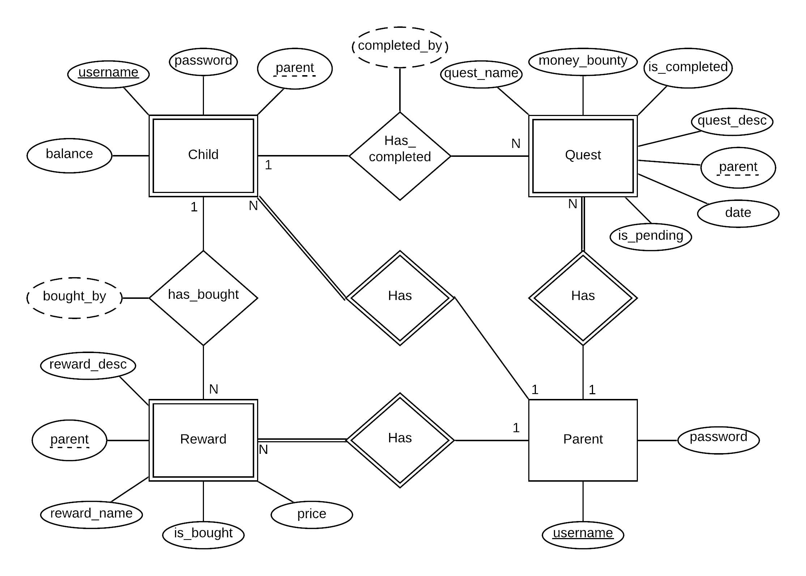

# Backend and Frontend Template

Latest version: https://git.ita.chalmers.se/courses/dit341/group-00-web (public Github [mirror](https://github.com/dit341/group-00-web))

## Project Structure

| File        | Purpose           | What you do?  |
| ------------- | ------------- | ----- |
| `server/` | Backend server code | All your server code |
| [server/README.md](server/README.md) | Everything about the server | **READ ME** carefully! |
| `client/` | Frontend client code | All your client code |
| [client/README.md](client/README.md) | Everything about the client | **READ ME** carefully! |
| [docs/DEPLOYMENT.md](docs/DEPLOYMENT.md) | Free online production deployment | Deploy your app online in production mode |
| [docs/LOCAL_DEPLOYMENT.md](docs/LOCAL_DEPLOYMENT.md) | Local production deployment | Deploy your app local in production mode |

## Requirements

The version numbers in brackets indicate the tested versions but feel free to use more recent versions.
You can also use alternative tools if you know how to configure them (e.g., Firefox instead of Chrome).

* [Git](https://git-scm.com/) (v2) => [installation instructions](https://www.atlassian.com/git/tutorials/install-git)
  * [Add your Git username and set your email](https://docs.gitlab.com/ce/gitlab-basics/start-using-git.html#add-your-git-username-and-set-your-email)
    * `git config --global user.name "YOUR_USERNAME"` => check `git config --global user.name`
    * `git config --global user.email "email@example.com"` => check `git config --global user.email`
  * > **Windows users**: We recommend to use the [Git Bash](https://www.atlassian.com/git/tutorials/git-bash) shell from your Git installation or the Bash shell from the [Windows Subsystem for Linux](https://docs.microsoft.com/en-us/windows/wsl/install-win10) to run all shell commands for this project.
* [Chalmers GitLab](https://git.ita.chalmers.se/) => Login with your **Chalmers CID** choosing "Sign in with" **Chalmers Login**. (contact [support@chalmers.se](mailto:support@chalmers.se) if you don't have one)
  * DIT341 course group: https://git.ita.chalmers.se/courses/dit341
  * [Setup SSH key with Gitlab](https://docs.gitlab.com/ee/ssh/)
    * Create an SSH key pair `ssh-keygen -t ed25519 -C "email@example.com"` (skip if you already have one)
    * Add your public SSH key to your Gitlab profile under https://git.ita.chalmers.se/profile/keys
    * Make sure the email you use to commit is registered under https://git.ita.chalmers.se/profile/emails
  * Checkout the [Backend-Frontend](https://git.ita.chalmers.se/courses/dit341/group-00-web) template `git clone git@git.ita.chalmers.se:courses/dit341/group-00-web.git`
* [Server Requirements](./server/README.md#Requirements)
* [Client Requirements](./client/README.md#Requirements)

## Getting started

```bash
# Clone repository
git clone git@git.ita.chalmers.se:courses/dit341/group-00-web.git

# Change into the directory
cd group-00-web

# Setup backend
cd server && npm install
npm run dev

# Setup frontend
cd client && npm install
npm run serve
```

> Check out the detailed instructions for [backend](./server/README.md) and [frontend](./client/README.md).

## Visual Studio Code (VSCode)

Open the `server` and `client` in separate VSCode workspaces or open the combined [backend-frontend.code-workspace](./backend-frontend.code-workspace). Otherwise, workspace-specific settings don't work properly.

## System Definition (MS0)

### Purpose

This is a chore reward application that helps parents create incentives for children to complete daily chores. A parent can set up custom tasks that reward the child with an in-app currency. This currency can then be exchanged for items in a shop. Items available in the shop are all created by the parent and represent real-life rewards provided by the parent for the child.

### Pages

* Login/Registration
During registration the user has to choose a username, account password and a parental password. When logging into an already existing account a user can select to log in as a parent or child using a checkbox and then type username and the account password or parent password depending on which mode one chooses. Logging in as a parent grants the parental functionalities.

* Calendar
This is the first page the user sees when logging in. The user can see all the days of the month, and a quick overview of the amount of tasks they have for a certain day, and have the option to select a certain day for a more detailed view.

* Quest log
The quest log page displays a list of all available chores for the currently selected date along with the amount of currency received for completing it and a chore description text. Every quest has an icon displayed next to it, selected by the parent from a handful of available icons when creating the quest. Each quest can be marked as complete by clicking the “quest complete” button.

* Rewards
The reward page displays all items available to purchase and their price. Every reward has an icon displayed next to it, selected by the parent from a handful of available icons when creating the reward.

* Quest log (Parent view)
The parent view of the quest log is a page that is only accessible to the parent. The parent can access this page by using the parent password. From here, the parent can create quests and delete or update already existing quests. Any quests added by the parent will be visible to the child in the regular quest log page. Quests which are selected as completed will be greyed out and marked as complete. A completed quest can be deleted and grant the reward for the chore or deleted without rewarding if the chore was not actually completed.

* Shop (Parent view)
The parent view of the shop is a page that is only accessible to the parent. By using the parent password, the parent can add, edit and delete items from the store page. The items in the shop will consist of a name, description and a price tag, and will represent a real life item/activity for the child.


### Entity-Relationship (ER) Diagram



## Teaser (MS3)


